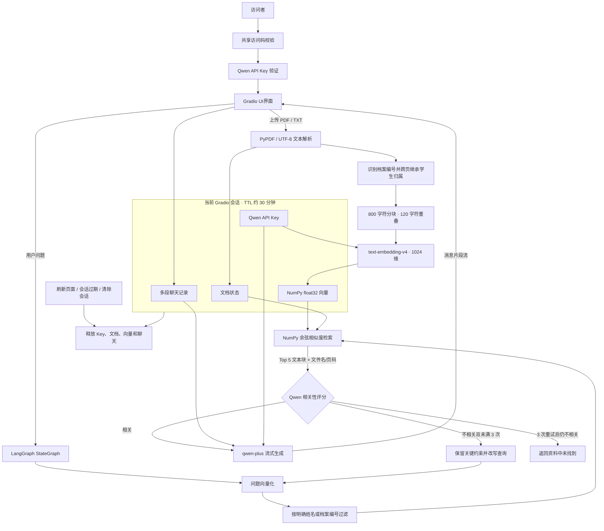

# 智能档案查询助手

[](https://www.python.org/)
[](https://www.gradio.app/)
[](https://langchain-ai.github.io/langgraph/)
[](https://help.aliyun.com/zh/model-studio/)
[](https://numpy.org/)
[](https://render.com/)
[](https://docs.python.org/3/library/unittest.html)

RAG 文档问答项目。访问者通过共享访问码进入应用，使用自己的阿里云百炼 Qwen API Key，上传文字版 PDF/TXT 后即可基于当前会话文档进行流式问答。

系统以 Gradio 提供 ChatGPT 风格交互界面，以 LangGraph 组织“检索—相关性评分—查询改写—生成”链路，使用 `text-embedding-v4` 生成向量，并通过 NumPy 在会话内完成余弦相似度检索。demo演示不依赖 PostgreSQL、Chroma 或其他持久化数据库

> **👉 在线演示 Demo：[点这里](https://app.mirastar.top)**


> **❗本项目用于展示会话级 RAG、流式生成和轻量云部署思路。AI 输出可能存在错误，请结合原始文档和实际情况判断；请勿上传真实病历、证件或其他敏感资料。**

## 项目亮点

- **会话级隐私隔离**：API Key、文档文本、向量和聊天记录只保存在当前 Gradio 服务端会话中，刷新、过期或清除会话后释放。
- **真正的流式生成**：Gradio 回调直接消费 `graph.stream(..., stream_mode="messages")`，逐片段 `yield` 到界面，避免额外 HTTP/SSE 转发造成整段缓冲。
- **轻量内存检索**：文档向量保存为 NumPy `float32` 数组，使用归一化点积完成余弦相似度排序，无需启动独立向量数据库。
- **自纠正检索**：Qwen 对 Top-K 片段进行严格相关性评分；结果不足时保留姓名、档案编号、时间等约束改写查询，最多重试 3 次后明确返回未找到。
- **跨页档案归属**：PDF 新档案页识别“学生姓名 + 档案编号”，后续页面自动继承归属；问题明确指定学生时，在向量排序前执行档案级硬过滤，防止不同学生成绩串档。
- **来源可追溯**：检索上下文携带文件名和 PDF 页码，提示模型在回答末尾列出参考来源；TXT 引用保留文件名。
- **文档处理保护**：支持格式、体积、页数和字符数限制，并使用 SHA-256 避免重复上传；临时文件解析完成后立即清理。
- **多会话交互**：当前页面内支持新建、切换和删除聊天，侧栏同步管理会话与已上传文档。
- **安全入口设计**：共享访问码使用恒定时间比较并限制连续尝试次数；Qwen Key 不写入数据库、文件、URL 或业务日志。
- **部署成本低**：单一 `webUI.py` 启动入口，可通过 `render.yaml` 部署到 Render Free Web Service。

## 系统架构与数据链路



### 请求链路

1. 用户通过共享访问码，随后在页面中验证 Qwen API Key。
2. PDF/TXT 在服务端临时目录解析；PDF 识别每份档案的学生姓名和档案编号，并将归属继承到没有重复标题的续页。
3. 文本块调用 `text-embedding-v4` 生成 1024 维向量，并归一化保存到当前会话内存。
4. 用户提问时，若问题明确包含学生姓名或档案编号，先将候选块限制在对应档案内，再执行余弦相似度计算。
5. `qwen-plus` 判断 Top 5 文本块是否足以回答原始问题；不相关时改写检索词并重新向量检索，最多改写重试 3 次。
6. 命中相关资料后，文件名、页码和最近 20 条消息交给 `qwen-plus`；重试后仍未命中则明确提示查不到。
7. LangGraph 按消息片段返回最终结果，Gradio 持续刷新助手气泡。

## 目录结构

```text
Project-2-Online/
├── webUI.py                 # 在线版唯一启动入口：UI、会话、上传、检索和流式生成
├── test_webui.py            # 不调用真实 Qwen API 的核心单元测试
├── requirements.txt         # Render 使用的精简运行依赖
├── requirements1.txt        # 本地依赖版本基线，不作为 Render 安装入口
├── render.yaml              # Render Blueprint 配置
├── .python-version          # Python 3.11 版本约束
├── .env.example             # 本地配置模板，不包含真实凭据
├── .gitignore               # 排除 Key、缓存、上传文件和本地数据
├── README.md                # GitHub 项目说明
├── main.py                  # 本地 FastAPI 实现，在线版不需要
├── ragAgent.py              # 持久化 Agent 实现，在线版不需要
├── apiTest.py               # 本地接口测试脚本，在线版不需要
├── prompts/                 # 使用的提示词
└── utils/                   # 本地实现使用的配置与工具
```

Render 的启动路径只有：

```text
python webUI.py
```

`main.py`、`ragAgent.py`、`prompts/` 和 `utils/` 不参与在线版运行。

## 技术选型

| 模块 | 实现 | 作用 |
|---|---|---|
| Web UI | Gradio 5.32.1 | 访问验证、Key 连接、文档管理、多会话聊天和 Markdown 展示 |
| 工作流 | LangGraph 0.2.74 | 组织检索、相关性评分、查询改写循环与回答生成节点 |
| 模型适配 | LangChain OpenAI | 通过 OpenAI-compatible 协议调用百炼模型 |
| 生成模型 | `qwen-plus` | 结合检索上下文进行中文流式回答 |
| Embedding | `text-embedding-v4` | 将文档块和用户问题转换为 1024 维向量 |
| 文本分块 | LangChain Text Splitters | 800 字符分块与 120 字符重叠 |
| 向量检索 | NumPy | 会话内向量归一化和余弦相似度 Top-K 排序 |
| PDF 解析 | PyPDF | 提取文字和页码，识别档案边界并为续页继承学生归属 |
| 状态管理 | `gr.State` | 隔离 API Key、文档向量和多段聊天记录 |
| 云部署 | Render Blueprint | Python Web Service、环境变量、健康检查和自动部署 |
| 测试 | Python `unittest` | 无真实模型调用的核心逻辑回归测试 |

## 快速开始

### 1. 获取代码

```bash
git clone https://github.com/Millastar/ProfileGraph.git
cd ProfileGraph
```

也可以直接进入已有的 `Project-2-Online` 本地目录。

### 2. 创建 Python 环境

推荐 Python 3.11：

```bash
conda create -n project2-online python=3.11 -y
conda activate project2-online
python -m pip install --upgrade pip
python -m pip install -r requirements.txt
```

项目部署只需要 `requirements.txt`。`requirements1.txt` 包含原本地环境的完整版本记录，不建议用于 Render 构建。

### 3. 配置环境变量

复制模板：

```bash
# Linux / macOS
cp .env.example .env

# Windows PowerShell
Copy-Item .env.example .env
```

编辑 `.env`：

```dotenv
APP_ACCESS_CODE=replace-with-your-long-random-code
QWEN_BASE_URL=https://your-workspace-id.cn-beijing.maas.aliyuncs.com/compatible-mode/v1
GRADIO_ANALYTICS_ENABLED=False
```

`QWEN_BASE_URL` 应填写阿里云百炼创建 API Key 时显示的 OpenAI-compatible API Host。API Key 不写入 `.env`，而是在打开网页后由用户输入。

### 4. 启动应用

```bash
python webUI.py
```

浏览器打开：

```text
http://127.0.0.1:7860
```

使用顺序：

1. 输入 `APP_ACCESS_CODE`。
2. 输入与 `QWEN_BASE_URL` 匹配的百炼 Qwen API Key。
3. 在侧栏上传文字版 PDF 或 UTF-8 TXT。
4. 等待向量化完成后开始提问。

### 5. 运行测试

```bash
python -m unittest -v test_webui.py
```

测试不访问真实 Qwen API，也不下载模型。

## 配置项

### 环境变量

| 环境变量 | 默认值 | 必填 | 说明 |
|---|---|---|---|
| `APP_ACCESS_CODE` | 无 | 是 | 演示网站的共享访问码；建议使用 32 位以上随机字符串 |
| `QWEN_BASE_URL` | `https://dashscope.aliyuncs.com/compatible-mode/v1` | 建议配置 | 百炼 OpenAI-compatible API Host，应与网页中输入的 Key 匹配 |
| `GRADIO_ANALYTICS_ENABLED` | `False` | 否 | 是否启用 Gradio 分析数据 |
| `PORT` | `7860` | 否 | 本地监听端口；Render 会自动注入自己的端口 |

### 模型与资源参数

| 参数 | 当前值 | 说明 |
|---|---|---|
| `CHAT_MODEL` | `qwen-plus` | 对话生成模型 |
| `EMBEDDING_MODEL` | `text-embedding-v4` | 文档与问题向量模型 |
| `EMBEDDING_DIMENSIONS` | `1024` | 向量维度 |
| `SESSION_TTL_SECONDS` | `1800` | 会话状态有效期，约 30 分钟 |
| `MAX_CONVERSATIONS` | `20` | 单个页面会话保留的聊天数量 |
| `MAX_DOCUMENTS` | `3` | 单个页面会话最多文档数 |
| `MAX_FILE_BYTES` | `10 MB` | 单文件体积上限 |
| `MAX_PDF_PAGES` | `50` | 单个 PDF 页数上限 |
| `MAX_DOCUMENT_CHARS` | `100,000` | 单文档最多提取字符数 |
| `CHUNK_SIZE` | `800` | 文本块目标长度 |
| `CHUNK_OVERLAP` | `120` | 相邻文本块重叠长度 |
| `TOP_K` | `5` | 每次问题使用的相关文本块数量 |
| `RETRIEVAL_RETRY_LIMIT` | `3` | 首次检索不相关后允许的查询改写重试次数 |

修改模型、分块或检索参数时，需要同步评估 API 成本、召回质量和 Render 内存占用。

## 部署

仓库提供 `render.yaml`，可直接创建 Render Blueprint：

```yaml
buildCommand: pip install --upgrade pip && pip install -r requirements.txt
startCommand: python webUI.py
healthCheckPath: /
```

Render 至少需要配置：

| 变量 | 用途 |
|---|---|
| `APP_ACCESS_CODE` | 共享访问入口 |
| `QWEN_BASE_URL` | 百炼 API Host |

部署时应固定 Python 3.11，避免 Render 默认 Python 版本与锁定依赖不兼容。

## 数据与安全边界

- Qwen API Key 仅保存在当前 `gr.State`，不会主动写入文件、数据库、URL 或业务日志。
- 文档解析后只保留会话内文本块和向量，Gradio 临时上传文件会被清理。
- 删除文档时同步删除其文本块、元数据和向量。
- 点击“清除本次会话”、刷新页面、会话超时或服务重启后，状态会释放。
- 使用 SHA-256 只为检测当前会话中的重复文件，不用于身份识别。
- 日志只记录提供商异常类型，不记录请求头、Key 或文档正文。
- 共享访问码是轻量演示限制，不是正式账号系统，也不等同于完整身份认证。
- Render 免费实例使用临时运行环境，本项目不承诺任何数据持久化。

建议使用独立、低额度、可随时撤销的百炼 Key，并使用不包含真实隐私信息的演示文档。

## 支持范围与限制

- 支持可复制文字的 PDF。
- 支持 UTF-8 和 UTF-8-SIG TXT。
- 不支持扫描 PDF、图片、Word、Excel 或 OCR。
- 多学生 PDF 建议每份新档案同时包含“学生姓名”和“档案编号”字段；系统据此识别边界并给后续页面继承归属。
- 单次检索只访问当前页面会话上传的文档。
- 当前版本没有账号注册、永久聊天记录或跨设备同步。
- 当前版本没有独立 Reranker；候选片段先按 embedding 余弦相似度排序，再由 Qwen 判断是否足以回答原问题。
- “参考来源”由检索上下文和系统提示共同约束，不替代人工核对原文。
- Qwen API Key 与 `QWEN_BASE_URL` 必须属于兼容的地域、业务空间和服务类型。

## 测试

```bash
python -m unittest -v test_webui.py
```

当前测试覆盖：

- 访问码必填、精确比较和错误状态；
- 两个页面会话之间的聊天隔离；
- UTF-8 TXT 提取与分块；
- 会话内余弦相似度排序；
- PDF 续页学生归属继承，以及姓名/档案编号的检索硬过滤；
- 删除文档时同步删除向量和元数据；
- 相关性 JSON 解析、查询改写保护和三次重试终止条件；
- 模型片段逐次更新到 Chatbot，而非完整生成后一次展示。

## 设计说明

### 为什么不使用向量数据库

在线演示版每个会话最多处理 3 个小型文档，向量规模有限。NumPy 内存检索减少了 Chroma、持久卷和数据库连接配置，也让会话清理和隐私边界更直观。若未来需要海量文档、跨会话知识库或长期持久化，应迁移到专业向量数据库。

### 为什么由用户输入 API Key

部署者无需把高额度模型凭据保存在公共服务中，也能避免所有访问者共享同一个调用额度。Key 仍会在服务端当前会话内用于模型调用，因此应使用专用低额度 Key，而不是生产业务凭据。

### 为什么保留共享访问码

Render 服务拥有公开 URL，共享访问码可以减少搜索引擎或无关访问产生的 API 消耗。但它没有账号、权限、审计或找回机制，只适用于作品集演示。

### 为什么不保存会话

无数据库设计降低了免费部署的资源和运维成本，也减少了演示文档与凭据被长期保留的风险。对应代价是刷新页面后需要重新输入访问码、Key 并上传文档。

## 相关文档

- [完整部署教程](./部署教程.md)
- [Gradio 文档](https://www.gradio.app/docs/)
- [LangGraph 文档](https://langchain-ai.github.io/langgraph/)
- [阿里云百炼 API Key](https://help.aliyun.com/zh/model-studio/get-api-key/)
- [阿里云百炼 Embedding](https://help.aliyun.com/zh/model-studio/embedding)
- [Render Blueprint](https://render.com/docs/infrastructure-as-code)
